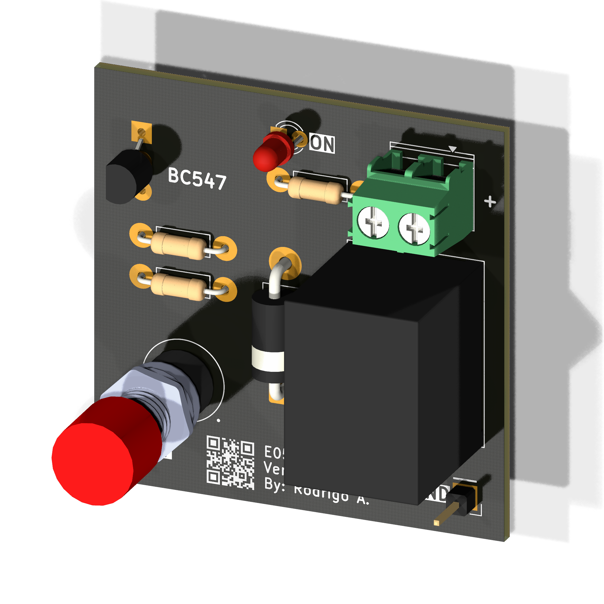
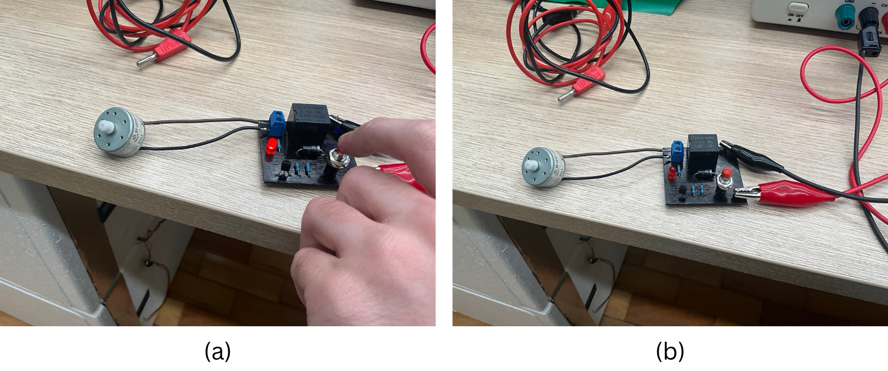

<h1 align="center">E05 - Motor Driver</h1>

    
    
    
    
    

    <a href="#overview">Overview</a> •
    <a href="#repository-organization">Repository Organization</a> •
    <a href="#releases">Releases</a> •
    <a href="#license">License</a>

## Overview
This project involves the development of a DC Motor Driver module tailored for the E05 (Transistorized Analog Electronics) course at Inatel. The system is engineered to handle electromechanical switching using a purely analog architecture, providing robust motor control based on a BC547 NPN transistor acting as a driver for a 5V SPDT relay (Songle SRD series). The hardware design incorporates inductive spike protection via a 1N5408 flyback diode, input state stabilization through a push-button with a pull-down network, and real-time visual feedback via an LED indicator.

    

## Repository Organization

* `docs`: Technical documentation and datasheets.
* `hardware`: Core hardware files.
    * `3D`: 3D models (.step).
    * `Fabrication`: BOM and Gerber files for JLCPCB manufacturing.
    * `PCB`: KiCad schematics and layout design.

## Releases

<table>
  <thead>
    <tr>
      <th>Render</th>
      <th>Board Name</th>
      <th>Status</th>
      <th>Latest Release</th>
      <th>Date</th>
      <th>Datasheet</th>
      <th>BOM</th>
      <th>Ordering Info</th>
    </tr>
  </thead>
  <tbody>
    <tr>
      <td></td>
      <td>Motor Driver v1</td>
      <td>✅ Released</td>
      <td><a href="https://github.com/Rorchive/E05/releases/tag/v1r2">v1r2</a></td>
      <td>2026-06-19</td>
      <td></td>
      <td>No</td>
      <td><a href="hardware/Fabrication/GERBER-Transistor_Driver.zip">GERBER</a> (JLCPCB)</td>
    </tr>
  </tbody>
</table>

## Circuit Operation

Figure (a) illustrates the driver module in its active state with the relay energized (latched) and the LED status indicator turned on while the push-button is pressed, completing the circuit to power the DC motor. Figure (b) depicts the circuit in its default idle state (relay de-energized) with no input applied to the button.

  
   
  <em>Figure 1: Side-by-side comparison of the mechanical mounting system: (a) Engaged state, (b) Disengaged state.</em>

## License

This project is licensed under the weakly-reciprocal **[CERN-OHL-W-2.0](LICENSE)** open-hardware license. You are free to modify and distribute these files, provided downstream hardware design modifications remain under the same terms.

---

 

  

📜 This project is part of <strong><a href="https://github.com/Rorchive">Rorchive</a></strong>, my personal archive of activities and courses developed during my undergraduate studies at <strong>Inatel</strong>.

  Built with ❤️ by <a href="https://github.com/RodrigoCAndrade">Rodrigo Andrade</a>

